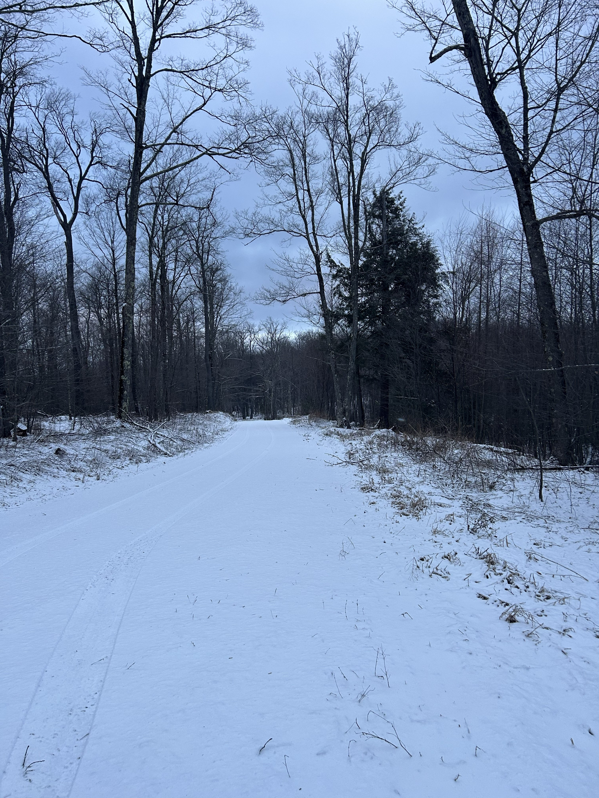
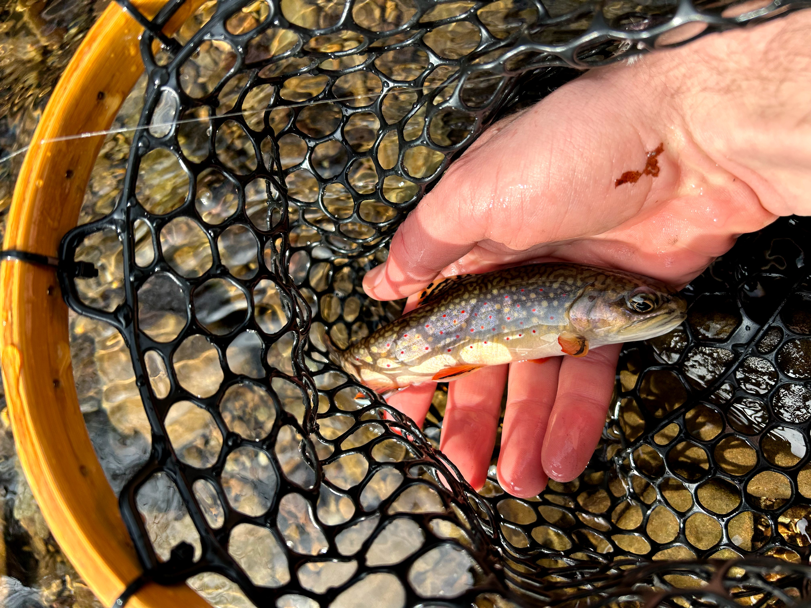
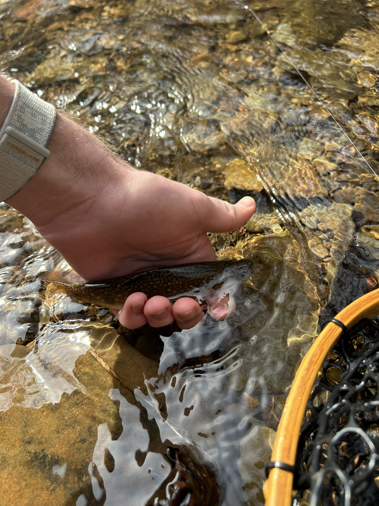

## Background

After my initial experience with fly fishing in November 2025, I ventured out on a few different day trips with friends in search of winter trout. These were great experiences that allowed me to learn more about the sport and get a feel for making casts with a fly rod. Despite the experience that I gained on these trips, I still had not caught a fish on a fly rod.

## A Fishing Trip

My second official fishing trip would take place over my spring break in 2026. I was once again joining my buddies Tyler and Jackson, this time, heading several hours north to the dark sky region of Pennsylvania. We left from college on a warm Friday evening in early March, and made the beautiful drive north to the mountains. The specific region around our destination was one that was largely unfamiliar to me at the time, so I very much enjoyed being able get my bearings and view the scenery on our drive up. As we neared camp, stream conditions for fishing were not looking great. Waterways were very high and fast-- not ideal for our objectives. Yet, we remained optimistic about the rest of our weekend. Arriving at camp for the night was an awesome feeling, we were very excited to get fishing. 

## An Unexpected Morning

After a good nights sleep, we were greeted with a cold morning and no power at camp! Initially, we were planning on getting our run in before heading out in search of trout. However, the conditions of the morning dampened our mood, and we instead elected to drive up the mountain to report our power outage. As we gained elevation, we were met with snow-- a drastic change compared to the warm weather we had experienced the day prior in south-central PA. Eventually, we headed down the mountain to gear up for our day of fishing. 

   

## On the Water

We hit the stream around 9:00. This small piece of water was particularly fast moving given the current conditions, but we remained optimistic given its history of containing a healthy population of brookies. Fortunately for us, our optimism was not foolish! In the first real hole that we fished, Tyler quickly pulled out a small brookie! We were quickly stoked and kept making our way upstream, trading off at each particular hole. I got a multitude of opportunities to put my fly into some nice holes. Although I was not able to net a fish, I was able to catch a variety of trees that morning! Jackson and Tyler ended the morning with 2 brook trout each. 

   

## Switching Gears

After a successful morning of fishing, we took a quick lunch at camp and regrouped for the afternoon. We would be fishing some larger streams in search of larger fish. After a lovely drive through the mountains on state forest roads, we pulled off and made a very short hike down to our stream.

   

A beautiful stream it sure was. This was my first real experience wading in deep and swift water. In the warmer afternoon and with many layers on, the cold water felt good on our legs. We fished this stream for about an hour, but were rather discouraged and not hopeful about finding success. Although clear, the water was quite high and swift; we were not confident in catching anything in these conditions. On our way out, we drove to a similarly sized stream nearby and found very similar conditions. Finally, we drove back to camp for the night and attempted to fish right at Tyler's camp. We once again found the same stream conditions and called it for the day.

## Brookie Sunday

After a restful nights sleep (except for an unfortunate incident at 5:30 AM, sorry Tyler and Jackson), we arose on a beautiful Sunday morning, and took in the brisk air on a run. We soon hit the road after a hearty breakfast and headed for our stream. After our first days experience of poor conditions on large streams, we were once again targeting small streams in search of small native brook trout. 

Arriving at the water, it was Tyler and Jackson's goal to get me a fish. Thus, I was the one fishing all of the holes. It was a beautiful stream, and looked like an ideal habitat. I must admit, I was feeling pretty discouraged throughout this. Continually casting into trees and generally making the same repeated mistakes, I was not confident in my abilities to get a fish. I am thankful for the patience, encouragement, and advice that Tyler and Jackson provided this weekend!

After some fly changes and fishing many holes, we turned around and sought after a different stream. After poking around for a while, were finally bailed on this stream as well. The flows were fast and we were not finding many pockets of fishable water. 

With our time in the mountains coming to a close, we headed back to the old faithful stream that we had fished the day prior in a last ditch effort. 

I had a purple haze tied on, the fly that Tyler chose because "[the fish] had never seen this before."

We made a beeline for the first hole that we had fished yesterday, where Tyler had caught the first brookie of the trip. Sneaking up to the edge of the hole, I made a simple roll cast and landed my fly in the center, below a little outflow. After a second, a fish swiped at it! I pulled it out and threw it back in, ready to set the hook. Sure enough, another, larger fish came up and took my fly. I was able to set the hook and Tyler scrambled over to net my first brook trout. It was an awesome feeling to say the least!

   

   

   

After the excitement, we couldn't help ourselves, and practically ran up the stream to fish a few more holes. It was another successful morning, as Jackson and Tyler each landed more fish!

Eventually, we made our way back to camp and packed up our gear for the drive home. All in all, it was an awesome way to spend the last couple days of our spring break. 

*Thanks to Tyler and Jackson for being great friends!*