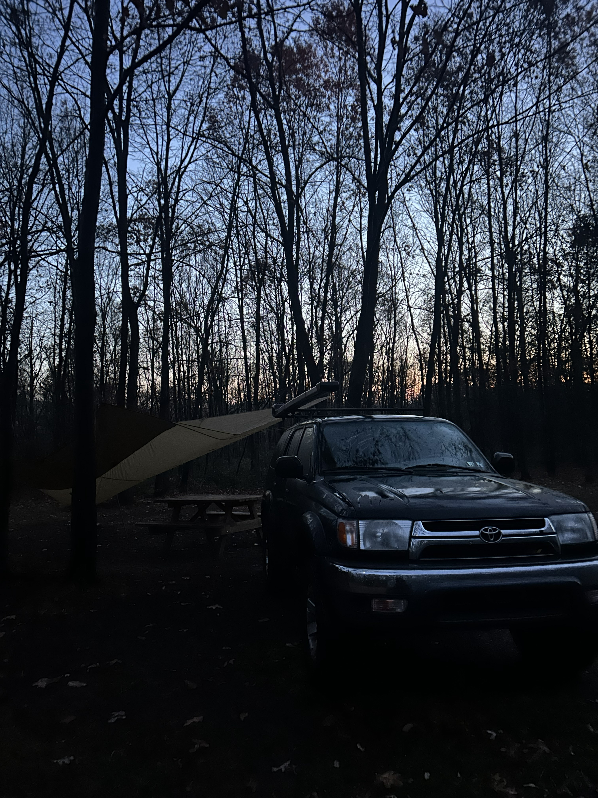

## First Experiences

Towards the end of my freshman year of college (Spring 2025), my close friend Jackson started getting into fly fishing. Jackson got taken under the wing of our older friend Tyler, who was a seasoned fly fisherman. Tyler took Jackson out on the water and showed him the ropes.

The following fall, Tyler and Jackson invited me to join them for a camping and fly fishing trip in the PA Mountains. Being someone who loves the woods and camping, and who was curious about fly fishing and wanting to spend time with my close friends, I naturally went along! It turned out to be an awesome weekend. It was my first real experience camping in the state forest land of Pennsylvania, and also my first time taking my 4Runner on a real trip. I had a blast driving into camp with Jackson on dark forest roads on a dreary November evening. After making camp, we enjoyed a delicious meal of mac and cheese with bacon bits and chicken, topped off with lots of cookies!

   

The next morning, we got up early and hit the water. We were targeting small mountain streams, seeking elusive native Brook Trout. Throughout the morning, we fished a couple of different streams, all unsuccessful. When I say 'we', I must establish that I was really just hanging out, poking about the woods and observing my buddies throw dry flies in the water. We went back to camp for lunch and packed everything up. We then bushwhacked down the hill from camp to the upper stretch of another stream. It was a beautiful stretch of water choked in rhododendrons. Yet we once again found ourselves skunked. The day was not over however, and we had a few more spots to fish on our way out of the woods.

   

### Fish On?

At this point, I had yet to even hold a fly rod, let alone attempted to put a fly on the water. Heading to a more prominent stream, we found some better looking water. Tyler and Jackson were able to each net a couple native brookies! Eventually, I found myself with Tyler's fly rod in my hand, on a beautiful and open stretch of creek. In between catching a couple of trees, I was able to pitch my dry fly into a good pocket of water. At one point, I was not paying close enough attention, and a fish had actually took my fly. After missing this hookset, I was determined to pay better attention. I did this successfully, although unfortunately I didn't react fast enough to set the hook!

Eventually, we left the woods and had a nice drive back to campus to conclude an awesome trip to the woods! This trip left me more interested in fly fishing and hopeful to get another shot at it!

*Thanks to Tyler and Jackson for an awesome trip!*
